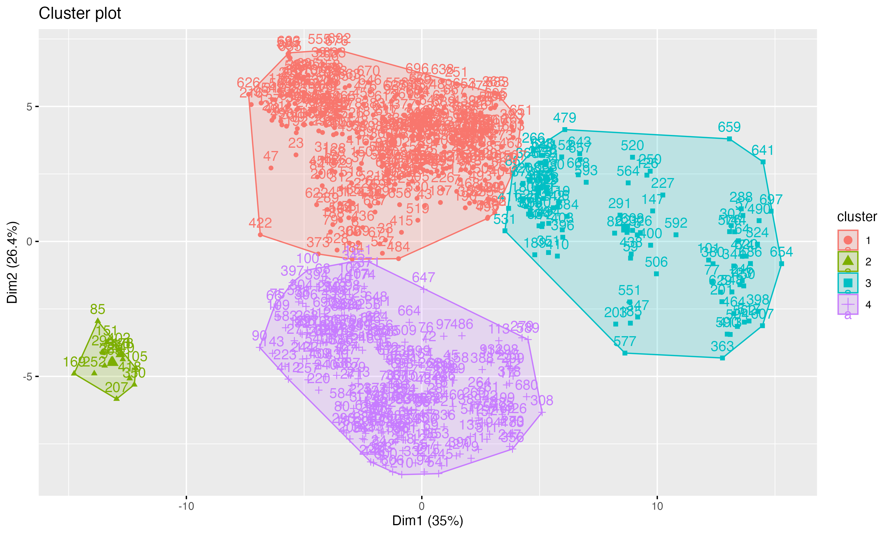

# Goal of this assignment  
The goal of this assignment is for you to **explore the k-means algorithm** learned in class.  

In specific, you will be asked to:  
  - Use a different number of k than what we did in class,  
  - Validate the results of the new model, and  
  - Compare your results with those found in class  

# Instructions  
You will first need to watch (and code along with) the following k-means video:

  - k-means lab: https://youtu.be/GFgMp5tYiMU?si=CI0E-2r-cYZLGVL1 (start from beginning of video, watch till the 01:10)  
  - The partial script for the video above is in our GitHub repository, 04-classcode, **02-24_multivar_kmeans_partial.qmd**. Move the script mentioned above into the `code` subfolder of your `06_multivar` project
  
**AFTER watching the video and developing the code in class**, then start working on this HW assignment (instructions below):
  - Move this script into the `code` subfolder of your `06_multivar` project  
  - On this script, fill your name under the `title` section of the YAML  
  - Go back to the class k-means script, choose a different number of k than what we did in class, and run it.    

# Questions  
## 1. What number of k did you select? Why?  
**ANSWER:** I selecte 3 as the next-best to 4, to see how they compare. This is based on 3 being within the appropriate range of the "elbow" method, and the secon-highest value in the silhouette method for optimal number of clusters. 
With 3 clusters, between_SS / total_SS =  41.8 %. This means that 41.8% of the variability in the data is explained by these clusters. 

**LIBRARIES**
```{r, message=FALSE, warning=FALSE}
library(tidyverse)
library(ggcorrplot)
library(broom)
library(car)
library(factoextra)
library(ggpmisc)
library(knitr)
```

**SETTING UP AND MAKING NEW CLUSTERS**
```{r}
weather <- read_csv("../Data/weather_monthsum.csv")

weather_n <- weather %>%
  dplyr::select(-c(year:strength_gtex))

weather_norm<- weather_n %>%
  mutate(across(everything(), ~scale(.x)))

mod_km_3clusters <- kmeans(weather_norm,
                     centers = 3,
                     nstart = 10)
mod_km_3clusters

```

## 2. How many observations are there in each cluster? 
**ANSWER:** Cluster 1 has 337 observations, while Cluster 2 has 108 and Cluster 3 has 253

```{r}
weather %>%
  mutate(cluster = mod_km_3clusters$cluster) %>%
  group_by(cluster) %>%
  tally()
```


## 3. Using the `fviz_cluster()` function, import here the original plot with k=4 did in class, and the new plot with the number of k you selected for this exercise. How do they visually compare? Which one seems to be a better choice, and why?  
**ANSWER: **
**How do they visually compare: ** While the red (first) cluster stays the same, the other clusters shift. Specifically, the bottom and small left cluster are combined when the number of clusters is reduced from 4 to 3, and the cluster on the right side of the graph (green when kmeans = 3) has a wider base. This is because the center of the blue cluster (kmeans = 3) is shifted to the left, allowing the cluster on the right to take over some of the points from what was originally in the purple (kmeans = 4) arrangement. 
**Which is better:** Having 4 clusters is better. Despite only 16 points being in cluster 2, separating those points allows for more similarity among points within their cluster than among all clusters. This is shown also within the WSS method of the fviz_nbclust() function - where 3 clusters can still be considered within the initial "drop" of WSS values, but after 4 the incremental improvement is small (the line flattens out). This suggests 4 is better. Similarly, the Silhouette Width in fviz_nbclust() with method = "s" shows that 4 has a width closer to +1, which suggests a well-clustered set of observations, where clusters are farthest from other clusters. 3 is second-best on that graph, being slightly closer to 0 in silhouette width. 

**IMPORTING IMAGE OF MOD_KM4 AND CREATING NEW ONE**
```{r}

fviz_cluster(mod_km_3clusters,
             data = weather_norm)
```

```{r}

```

# Submitting your work  
Once you have developed all the code and answers, make sure to Render this quarto file.  

**Notes on rendering**:  

- Make sure to render your work and inspect how the final html look like.  
- If it does not look professional for whatever reason, then fix the issue, re-render it, recheck.  
- Only send me your work once your html file looks professional.  
  - **DO NOT** delete the file's heading levels (# and ##). They set up the proper heading 1 and 2 levels, and I use them to guide my grading.  
  - If a given chunk is also outputting warnings or messages, inhibit this behavior by changing the chunk options `message` and `warning` to `FALSE` (I'll demo this in a moment).  
  
  - If, after rendered, 2 lines of text are connected and you wish to "break line" between them, add 2 extra spaces after the first one (I'lld demo this in a moment).  

After rendering, an .html file will be created on your `code` folder.  

Rename this file to `Assignment-05-kmeans-LASTNAME.html`.    

For ex., mine would be `Assignment-05-kmeans-Bastos.html`.

Submit your work by uploading the **html** file to **eLC Assignment #5 - K-means** by Monday March 2nd 11:59 pm.  
  


